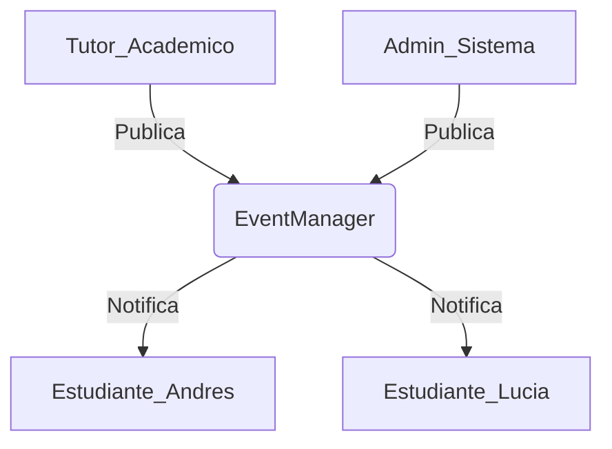
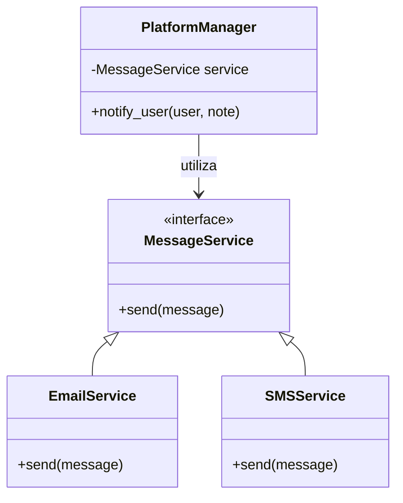

# Taller 2: Patrones de Diseño - Semana 7

## Descripción del Proyecto

Este repositorio contiene la implementación práctica de dos patrones de diseño arquitectónicos solicitados en el taller:

1. **Publish-Subscribe**: Un sistema que permite la comunicación entre emisores (Publishers) y receptores (Subscribers) de forma desacoplada y dinámica.
2. **Inyección de Dependencia**: Implementación utilizando *Constructor Injection* para garantizar que las dependencias sean intercambiables y faciliten el testeo mediante Mocking.

---

## Estructura de Archivos.

```text
Arquitectura/
├── src/
│   ├── publish_subscribe.py    # Código del Patrón Pub-Sub
│   └── dependency_injection.py # Código del Patrón DI
├── tests/
│   └── test_mocking.py         # Pruebas unitarias y Mocking
├── .gitignore                  # Archivos excluidos de Git
└── README.md                   # Documentación principal
```

---

## Diagramas de Arquitectura

### 1. Patrón Publish-Subscribe.



---

### 2. Patrón Inyección de Dependencia



---

## Instrucciones de Ejecución

### 1. Clonar el repositorio

```bash
git clone https://github.com/TU_USUARIO/TU_REPOSITORIO.git
cd Arquitectura
```

---

### 2. Ejecutar Patrón Publish-Subscribe

Este script demuestra el registro de suscriptores, la publicación de eventos por parte de publishers y la desuscripción dinámica de un usuario.

```bash
python src/publish_subscribe.py
```

---

### 3. Ejecutar Patrón Inyección de Dependencia

Muestra cómo se inyectan diferentes servicios (Email y SMS) en la lógica de la plataforma.

```bash
python src/dependency_injection.py
```

---

## Pruebas y Mocking

Para verificar que las dependencias pueden ser reemplazadas por objetos simulados (Mocks) para pruebas aisladas:

```bash
python -m unittest tests/test_mocking.py
```

---

## Ejemplo de Salida Esperada

```
Ran 1 test in 0.001s
OK
```

---
